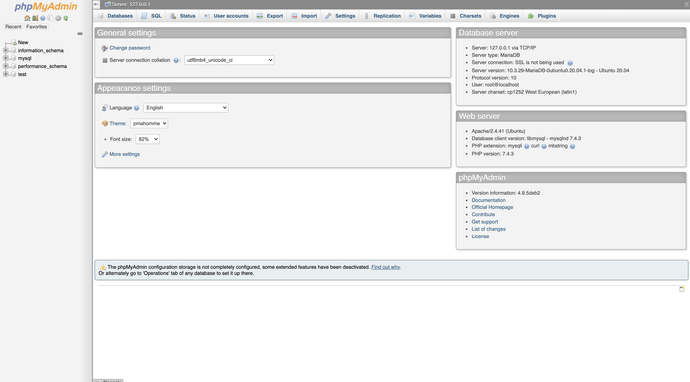

[Applications](../../../Applications.md) > [Compute1 Applications](../../Compute1%20Applications.md) > [RIS Developed Containers](../RIS%20Developed%20Containers.md)

# Web Development Container

- [Software Included](#software-included)
- [Build Web Development Docker Container](#build-web-development-docker-container)
- [Submitting the Web Development Job](#submitting-the-web-development-job)

> [!IMPORTANT]
> Compute Resources
>
> - Have questions or need help with compute, including activation or issues? Follow [this link.](https://washu.atlassian.net/servicedesk/customer/portal/2/group/6/create/43)
> - [RIS Services Policies](../../../RIS%20Services%20Policies.md)

> [!IMPORTANT]
> Docker Usage
>
> - The information on this page assumes that you have a knowledge base of using Docker to create images and push them to a repository for use. If you need to review that information, please see the links below.
> - [Docker and the RIS Compute1 Platform](../../../Compute1/Docker%20and%20the%20RIS%20Compute1%20Platform.md)
> - [Docker Basics: Building, Tagging, & Pushing A Custom Docker Image](../../../Docker/Docker%20Basics_%20Building,%20Tagging,%20&%20Pushing%20A%20Custom%20Docker%20Image.md)

> [!IMPORTANT]
> storageN
>
> - The use of `storageN` within these documents indicates that any storage platform can be used.
> - Current available storage platforms:
>
>   - storage1
>   - storage2

# Software Included

- Apache2 (<https://httpd.apache.org/> )
- Git (<https://git-scm.com/> )
- MariaDB (<https://mariadb.org/> )
- PHP (<https://www.php.net/> )
- PHPMyAdmin (<https://www.phpmyadmin.net/> )

# Build Web Development Docker Container

Before building the web devlopment Docker Container, we must clone the public GitHub repository. The web development GitHub repository contains all the requisite files required for building the web development Docker container for use on compute1.

1. Log onto compute1 (replacing `washukey` with your assigned WashU Key)

```
> ssh washukey@compute1-client-1.ris.wustl.edu
```

2. Clone the RIS web development Docker repository to `$HOME` on compute1

```
> cd $HOME && git clone https://github.com/nhatas/ris_webdev_docker_container
```

3. Build and push your Docker container to [Docker Hub](https://hub.docker.com/). Documentation on how to do this can be found [Docker Tutorial](../../../Docker/Docker%20Tutorial.md).

# Submitting the Web Development Job

1. Set the `MYSQL_PATH` environment variable to the path you wish to store your database files. In the example below the database files will be stored in the user’s home folder.

> [!IMPORTANT]
> Please refer to our [FAQ](../../../FAQ.md) for more information on the available home folder disk space.

```
> export MYSQL_PATH="$HOME/mysql"
```

> [!WARNING]
> Complete export `MYSQL_PATH=` with a path to a folder you have access to. Do not leave this blank.

2. Set the LSF\_DOCKER\_VOLUMES environment variable to mount the location of your webserver files, as well as any other folders you wish to have access to inside of the docker container. Documentation on this environment variable can be found [Docker Wrapper Environment Variables](../../../Compute1/Docker%20Wrapper%20Environment%20Variables.md).

```
> export LSF_DOCKER_VOLUMES="/storageN/fs1/${STORAGE_ALLOCATION}/Active/webserver/:/var/www/html/"
```

3. Submit the job using bsub and the LSF\_DOCKER\_PORTS environment variable to allow web access to the Docker container. In the example below, port 8080 is used to access the Docker container. Documentation on this environment variable can be found [Docker Wrapper Environment Variables](../../../Compute1/Docker%20Wrapper%20Environment%20Variables.md).

```
> LSF_DOCKER_PORTS="8080:8081" bsub -Is -R "select[port8080=1]" -q general-interactive -a 'docker(location-of-docker-image)' /bin/bash
```

> [!IMPORTANT]
> You are a member of multiple LSF User Groups:
>
> If you are a member of more than one compute group, you will be prompted to specify an LSF User Group with -G group\_name or by setting the LSB\_SUB\_USER\_GROUP variable.

- Since LSF is running interactively, it will output the name of the host it’s running on in the terminal.
- The host will be the IP address needed to access the webserver files.
- For example: `<<Starting on compute1-exec-187.ris.wustl.edu>>` translates to the IP being `https://compute1-exec-187.compute.ris.wustl.edu:8080`
- Please see our [Job Execution Examples](../../../Compute1/Job%20Execution%20Examples.md) for more information on selecting a port.

4. Once connected, run a script to start the Apache 2 server and generate MYSQL configuration files.

```
> /app/script.sh
```

5. Access PHPMyAdmin by appending /phpmyadmin to the address of the host from step 3.

- Using the example host IP from step 3, the address to access PHPMyAdmin would be: `https://compute1-exec-187.compute.ris.wustl.edu:8080/phpmyadmin`
- The PHPMyAdmin username is root and there is no password.


> [!IMPORTANT]
> Version Control:
>
> Git is available in the Docker container to track and commit changes to your web development files.
