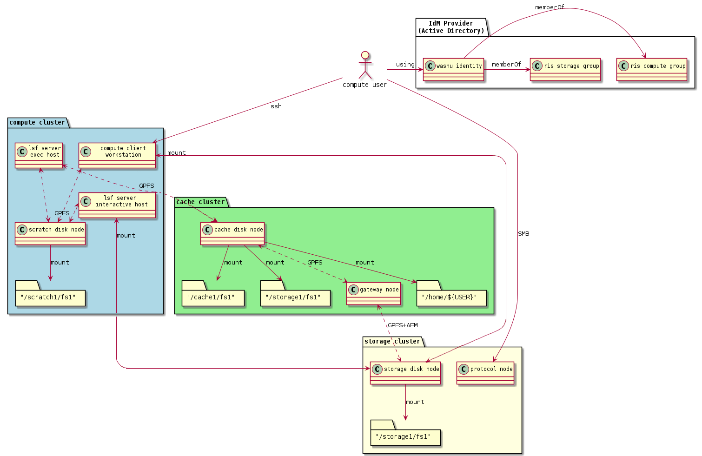

[Compute1](../Compute1.md)

# Access Storage Volumes

- [Storage Overview](#storage-overview)
- [Storage Cluster Diagram](#storage-cluster-diagram)
- [Data Policies](#data-policies)
- [Cache in Regards to Docker](#cache-in-regards-to-docker)
- [Normal Operations](#normal-operations)
- [Frequently Asked Questions](#frequently-asked-questions)

> [!IMPORTANT]
> storageN
>
> - The use of `storageN` within these documents indicates that any storage platform can be used.
> - Current available storage platforms:
>
>   - storage1
>   - storage2

# Storage Overview

The RIS Compute Platform is integrated with the RIS Storage Platform, but both the Compute and Storage Platforms incorporate **storage tiers**. The summary of the available storage tiers from the perspective of a compute user is:

- Compute exec nodes access a **scratch** space and a **cached view of the storage1 platform**.
- The **scratch** space is: `/scratch1/fs1/${COMPUTE_ALLOCATION}`.
- Data in the scratch tier should be considered **temporary** and manually managed up to a quota.
- The **cached** view of storage is at: `/storage1/fs1/${STORAGE_ALLOCATION}`.
- Data is not manually managed, but constantly synced between the cache and the storage cluster as your read and write activity demands it.

> [!WARNING]
> It is important to remember that `/storage1/fs1/${STORAGE_ALLOCATION}` is a cache. The caching performance depends upon the current operating status of the compute cluster, which is to say that if it is **busy** there may be latency in observing updates to the data. This does not pertain to the Storage2 Platform.

# Storage Cluster Diagram



# Data Policies

## Storage

- The client (login) nodes are connected directly to the RIS Storage1 Platform.
- The general-interactive queue nodes are connected directly to the RIS Storage1 Platform.
- These are both set up this way so that a user’s interaction with their data is more responsive than what using the cache system (documented below) currently allows for.
- All connections to the Storage2 Platform are direct connections.
- There may be a slight delay (up to 5 seconds) of viewing changes made on one connection via another connection. (e.g. Between execution hosts)
- Storage Platforms are NOT designed as a place to share office docs.

## Archive

- Archive storage is intended for long term data retention and NOT data that needs to be accessed regularly. Data moved to Archive resides on tape.
- If data moved to Archive needs to be accessed again, it will need to be moved back to Active, and recalled from tape.
- Data being moved to Archive should be compressed via tar.
- Archive is NOT meant for data that is still being analyzed or will be analyzed within a few month’s time.

  - Archive is a “cold storage”, meaning it is for inactive data.
- Recall times are dependent on the folowing.

  - Size of the data
  - How many tapes the data is spread across
  - How many other backup or recall jobs are running
  - How many tape drives are available.
  - It is not possible to predict how long a recall will take because of these factors.

## Cache (Storage1)

- The cache provides an interface for the batch jobs in the general queue and for condos to the RIS Storage cluster.
- The goal is to be completely transparent to the user. Users don’t actively need to “move” data to or from the cache layer.
- Cache filesets are the representation of the corresponding storage1 fileset to the compute1 cluster.
- Data is continuously synced between the cache and storage layers.

  - Before a file is finished syncing between cache to storage, it will appear in the compute environment but not when connecting to storage via SMB.
  - This can take time depending on the load on either storage layer.
  - Read more about how this here: [Space Management](Space%20Management.md)
- Only file reads and writes (not metadata requests) causes a file to be moved between layers.
- A storage allocation maps to a cache space of the same name at `/storage1/fs1/${STORAGE_ALLOCATION}`.
- Data remains in the cache layer until a **soft quota** is reached, at which time **cache eviction** is triggered and data is removed from the cache.

  - This quota is what triggers “eviction” of the cache fileset, meaning files that have already been written back to the storage1 “home” fileset are deleted.
  - Files that have not yet been written back to storage1 (aka “dirty” files) are not deleted.
- A **hard quota** limits total capacity in the cache for a given allocation.

> [!WARNING]
> Storage1 vs Cache conflicts:
>
> Given the diffent methods of connecting to the RIS Storage cluster between the client and interactive nodes, and the batch nodes (general queue) and condos, this could lead to filesystem conflicts. [Space Management](Space%20Management.md)
>
> To minimize this potential, we suggest that users do NOT have interactive jobs and batch jobs running that write to the same directory. Additionally, users should refrain from doing operations to directories batch jobs are writing to via the client (login) nodes or via an SMB mount.

## Scratch Space

- Scratch space is considered a “global temporary space”. Users should not store their only copy of data in scratch.
- Scratch space is available at `/scratch1/fs1/${COMPUTE_ALLOCATION}`.
- Data must be manually put into `/scratch`.
- The `setgid` bit is set at `/scratch1/fs1/${COMPUTE_ALLOCATION}`, all contents should have **group** set to `${COMPUTE_GROUP}`.
- The `/scratch` space has quotas set based on compute-group membership (as opposed to fileset quotas, that are in place on `storage1`).
- Your `${COMPUTE_GROUP}` will have a default **quota** of 5% of your storage allocation size, but no less than 1Tb.
- Exceeding the **quota** will trigger a denial after which no further writes will be allowed until your `${COMPUTE_GROUP}` removes data and goes below the **quota**.
- Files and directories will be automatically deleted from `/scratch` when their last modified date (`mtime`) is older than the LSF job run limit, currently 28 days.
- Weekly usage reports are currently written to each scratch directory in a file called RIS\_Usage\_Report.txt
- When files are deleted, the list of deleted files will be written to a scratch directory in a file called RIS\_cleanup\_policy.{labname}

# Cache in Regards to Docker

- Docker on each exec host will download images and save them to the exec host’s local storage drives, caching them for future docker runs.
- We have a script run periodically to remove docker containers from this local storage, that has not been accessed in a while (30 days), or when the local disk is running out of space for new docker pull requests.

# Normal Operations

Users submit compute jobs to the cluster via the *job scheduler*. Your shell environment includes parameters that modify the behavior of the job launcher. Use `LSF_DOCKER_VOLUMES` to specify which storage volumes to make visible to your compute job.

When a job is submitted, the current working directory `$PWD` is the only volume automatically mounted in the job’s container. Other volumes, home directories or other data volumes, must be specified in the `LSF_DOCKER_VOLUMES` environment variable. Multiple volumes can be mounted by separating them with spaces.

Note below that the HOME environment variable is automatically populated by the shell.

```
> ssh ${USER}@compute1-client-1.ris.wustl.edu
> export SCRATCH1=/scratch1/fs1/joe.user
> export STORAGEN=/storageN/fs1/joe.user/Active
> export LSF_DOCKER_VOLUMES="$HOME:$HOME $STORAGEN:$STORAGEN $SCRATCH1:$SCRATCH1"
> bsub -G ${group_name} -Is -q general-interactive -a 'docker(ubuntu)' /bin/bash
Job <7815889> is submitted to queue <general-interactive>.
<<Waiting for dispatch ...>>
<<Starting on compute1-exec-15.ris.wustl.edu>>
Using default tag: latest
latest: Pulling from ubuntu
Digest: sha256:d52d45eebe697ef1247c442942f3a2574fd73baf9258a2a3780ef56fbe34332f
Status: Image is up to date for ubuntu:latest

$USER@compute1-exec-15> ls -ld $HOME $STORAGEN $SCRATCH1
drwx------. 20 $USER    domain users  8192 Mar 26 16:19 $HOME
drwx------.  5 root     root         32768 Dec 12 22:05 /scratch1/fs1/...
drwx------.  9 root     root          8192 Mar 24 05:02 /storageN/fs1/.../Active
```

## Store Environment Variables in .bashrc

You can permanently store these settings by including them in your ~/.bashrc file where they will be loaded each time you log in. But be sure to remember that they are there. Historically, users forget what’s in their .bashrc, and when systems change, updates to .bashrc may be required. Consider reminding yourself they are present with an “echo” statement.

```
# .bashrc example
echo "Loading LSF_DOCKER_VOLUMES from ~/.bashrc"
export SCRATCH1=/scratch1/fs1/joe.user
export STORAGEN=/storageN/fs1/joe.user/Active
```

> [!IMPORTANT]
> LSF\_DOCKER\_VOLUMES in .bashrc and .bash\_profile
>
> - It is considered best practices not to include LSF\_DOCKER\_VOLUMES in your .bashrc or
>
> .bash\_profile files. - Including this directly can cause issues with some software. - It is considered best practices to declare LSF\_DOCKER\_VOLUMES for each job individually.

## Run Mounted Scripts

In the above example, source data was mapped inside the container to location `/data`. To run, say, a python script from within a mounted file named demo.py:

```
> cd /data
> python demo.py
```

## Storage Volume Paths

The “source” pathname on the left of the colon must be a path that exists outside the container on a GPFS filesystem. Examples include storageN volumes like `/storageN/fs1/${USER}/Active` or compute1 home directories `/home/${USER}`.

The “destination” path on the right designates the path where the source appears within the container, and can be virtually any pathname. Mounting a volume over a path that already exists within the container will effectively hide their contents; only the source volume’s files will be visible.

Attempting to use a non-GPFS directory as a source will result in an error: “LSF\_DOCKER\_VOLUMES volume /path is not GPFS. This is not allowed”.

> [!IMPORTANT]
> Since spaces are used to separate multiple volumes in LSF\_DOCKER\_VOLUMES, volume paths containing spaces in their name must escape those spaces with a backslash. For example:
>
> ```
> LSF_DOCKER_VOLUMES=’/storageN/fs1/${STORAGE_ALLOCATION}/Active/pathwithspaces:/storageN/fs1/${STORAGE_ALLOCATION}/Active/pathwithspaces’
> ```

> [!IMPORTANT]
> “Destination” paths cannot be used as “source” paths when starting a job from within another container, even if the files are ultimately stored on a GPFS filesystem. Use the canonical GPFS path instead.

> [!IMPORTANT]
> Elements in LSF\_DOCKER\_VOLUMES must be *directories*. Docker would allow you to pass in files, such that the following might be expected to work:
>
> ```
> LSF_DOCKER_VOLUMES=”$HOME/etc/myfile:/etc/somefile”
> ```
>
> But the RIS environment explicitly prevents this due to a security vulnerability.

> [!IMPORTANT]
> When creating directories or files, it is best practices to avoid using spaces within the name. If you need to separate parts of a name, it is highly recommended that you use dashes `-` or underscores `_`.
>
> Linux environments do not handle spaces in names well and when it comes to attempting to mount a directory with spaces in it, it will not mount via `LSF_DOCKER_VOLUMES`.

# Frequently Asked Questions

## Why is there this cache layer?

The caching layer has been very difficult. But it was born out of a real performance need. Past iterations of our computing clusters did not have a caching layer, and the compute execution nodes were “directly attached” to the storage NSD “disk” servers. This leads to the “stampeding herd” and “noisy neighbor” problems, where the ad hoc or random nature of compute workloads in our general purpose computing clusters lead to situations where one user’s set of highly IO intensive compute workload can impose IO latency for every other user. This is most commonly felt as, “Why is my session slow?”

We still see these “slow” behaving or “high IO latency” scenarios within the compute cluster, but we believe that overall the cache layer reduces the frequency and impact of these “high IO” events substantially.

## How much space is in each layer?

At the time of this writing scratch is about 300T in size:

```
[compute1-client-1 ~]$ df -h /scratch1/fs1
Filesystem      Size  Used Avail Use% Mounted on
scratch1-fs1    278T  276T  2.1T 100% /scratch1/fs1
```

and cache is about 500T in size:

```
[compute1-client-4 ~]$ df -h /storage1/fs1
Filesystem      Size  Used Avail Use% Mounted on
cache2-fs1      498T  316T  182T  64% /storage1/fs1
```

Remember that from the point of view of the client and exec nodes, `/storage1/fs` is the cache.

## How does each layer grow/expand over time?

RIS works with our Governance Committee, reporting growth over time, and solicit funds for expansion as directed by IT Governance.

## Can I purchase dedicated scratch or cache space?

Not at this time.

## Can I “reserve” scratch or cache space for some time?

Not at this time.

## What are the performance characteristics of each layer?

- `/scratch1/fs1` is the fastest performing storage tier.
- `/cache1/fs1` is the next fastest performing storage tier. It is about half as fast as scratch.

  - There is an SSD and a SAS7K disk pool servicing the cache.
  - We strive to keep data in the SSD disk pool to maintain maximum performance.
  - If data in the cache moves to the SAS7K pool, it will be noticeably slower.
- `/storage1/fs1` the Active tier is next in performance

  - There is an SSD and a SAS7K disk pool servicing the storage1
  - We strive to keep data in the SSD disk pool to maintain maximum performance.
  - If data in the cache moves to the SAS7K pool, it will be noticeably slower.
