[Compute1](../Compute1.md)

# Open OnDemand

- [What is Open OnDemand?](#what-is-open-ondemand)
- [What Does This Mean for Users?](#what-does-this-mean-for-users)
- [Getting Started](#getting-started)
- [Files](#files)
- [Jobs](#jobs)
- [Active Jobs](#active-jobs)
- [Job Composer](#job-composer)
- [Clusters](#clusters)
- [Interactive Apps](#interactive-apps)
- [My Interactive Sessions](#my-interactive-sessions)
- [Terminal](#terminal)

> [!IMPORTANT]
> Compute Resources
>
> - See the [RIS Service Desk](https://washu.atlassian.net/servicedesk/customer/portal/2/group/6/create/43) for additional assistance.
> - [RIS Services Policies](../RIS%20Services%20Policies.md)

> [!IMPORTANT]
> storageN
>
> - The use of `storageN` within these documents indicates that any storage platform can be used.
> - Current available storage platforms:
>
>   - storage1
>   - storage2

# What is Open OnDemand?

- “An intuitive, innovative, and interactive interface to remote computing resources” -[Open OnDemand Website](https://openondemand.org/)
- Open on Demand or OOD is a web browser based interface that connects to compute resources, in this case, the RIS Compute Platform.

# What Does This Mean for Users?

- Access the RIS Compute Platform via a web browser.
- Use any number of supported applications or incorporate their own.
- Navigate the RIS Compute Platform and their computing needs in a GUI instead of via the command line.

# Getting Started

- The compute1 platform must be connected to via `ssh` at least once prior to connecting to Open OnDemand to properly set up the user home directory. Instruction can be found in the [Compute1 Quickstart](Compute1%20Quickstart.md).
- Point browser to [http://ood.ris.wustl.edu](http://ood.ris.wustl.edu/).

# Files

- Display files and directories in the user’s home directory.
- Due to OnDemand implementation restrictions, navigation to `storageN` or `scratch1` cannot be done through this page.

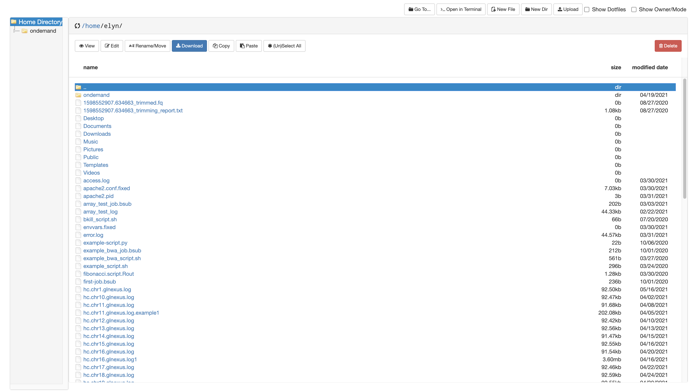

# Jobs

- View active jobs
- Use Job Composer to create scripts and launch batch jobs.

# Active Jobs

- Lists user’s currently pending and running jobs on compute1 (not exclusive to those launched via OnDemand).

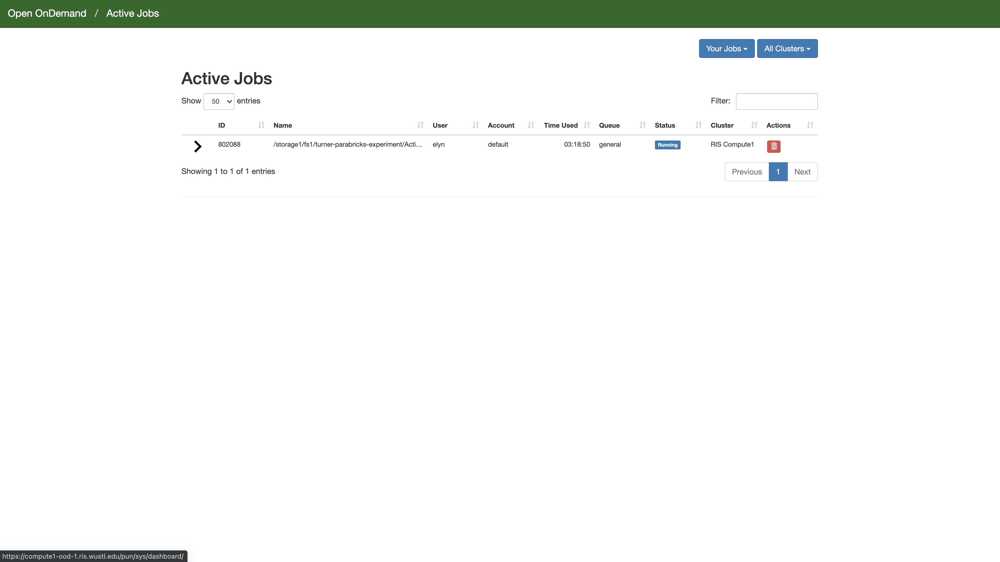

- Select the red trash bin to the right of the job listing to terminate a job (same as bkill).
- Select the arrow to the left of the job listing to view job details (same as bjobs output).

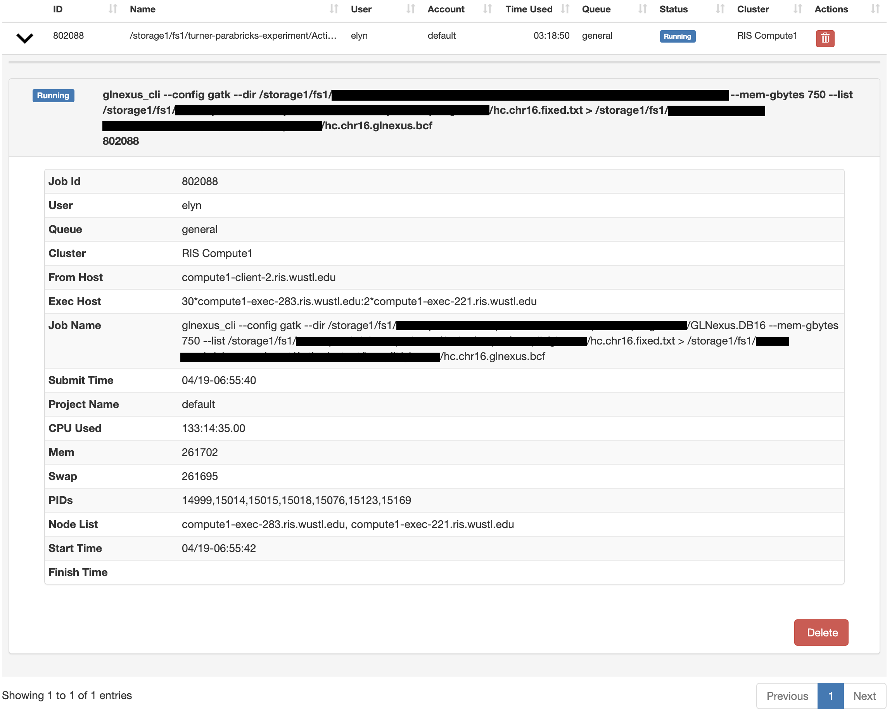

# Job Composer

- Create and launch batch jobs similar to using a `.bsub` job file.
- Job and resource parameter information can be found on the [Job Execution Examples](Job%20Execution%20Examples.md) page.

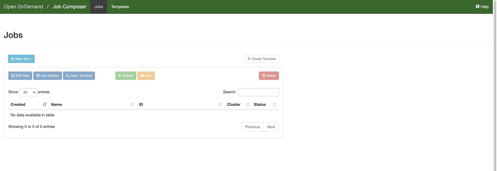

- Jobs can be created from: - Default template - Specified path - Existing job (running or completed).

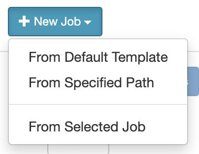

- Once a source is selected an editor will become available.

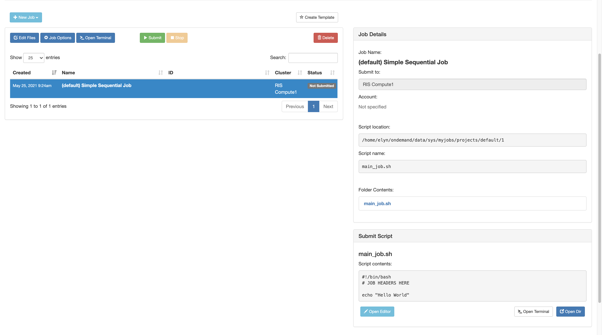

- Sample job file:

```
#!/bin/bash
#BSUB -q general
#BSUB -g /username/groupname
#BSUB -a 'docker(ubuntu)'

echo "Hello World"
```

> [!IMPORTANT]
> - If a member of more than one compute group, specify the LSF User Group with `#BSUB -G group_name`.
> - The `-g` option must be included here.
> - Each bsub option must have its own `#BSUB` line.

- Click Save.
- Select Submit to launch a new batch job using a created script.

# Clusters

- Launch command-line and batch jobs from a terminal session.
- Access to all compute1 resources available from this client node.

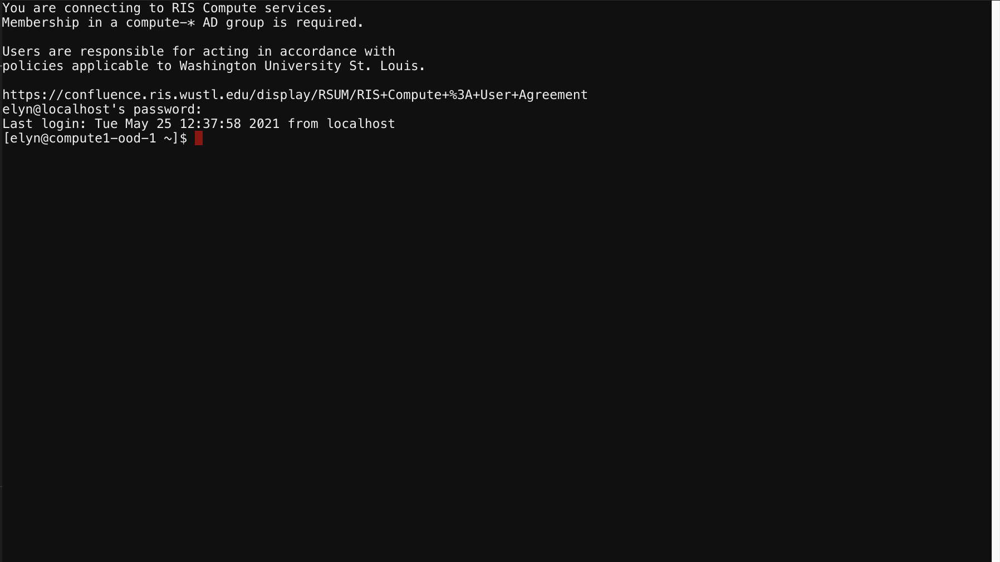

# Interactive Apps

- Run interactive jobs with GUI.

  - Select application name from the Interactive Apps dropdown.
  - Configure storage/scratch mounts and resource options for the job.
  - Select Launch to submit the job.
- Ability to run custom images that specifically leverage the [noVNC](../Applications/Compute1%20Applications/RIS%20Developed%20Containers/noVNC.md) via the `Custom noVNC Image` application. This application also allows for extended resource usage such as spanning multiple hosts.

> [!IMPORTANT]
> Custom noVNC Image Requirement:
>
> The Custom noVNC Image in Open OnDemand is only guaranteed to run if leveraging the current RIS noVNC version(s) due to the included dependencies and startup scripts. Instruction on extending this image is found in the [noVNC](../Applications/Compute1%20Applications/RIS%20Developed%20Containers/noVNC.md) documentation.

# My Interactive Sessions

- View pending and running interactive sessions.

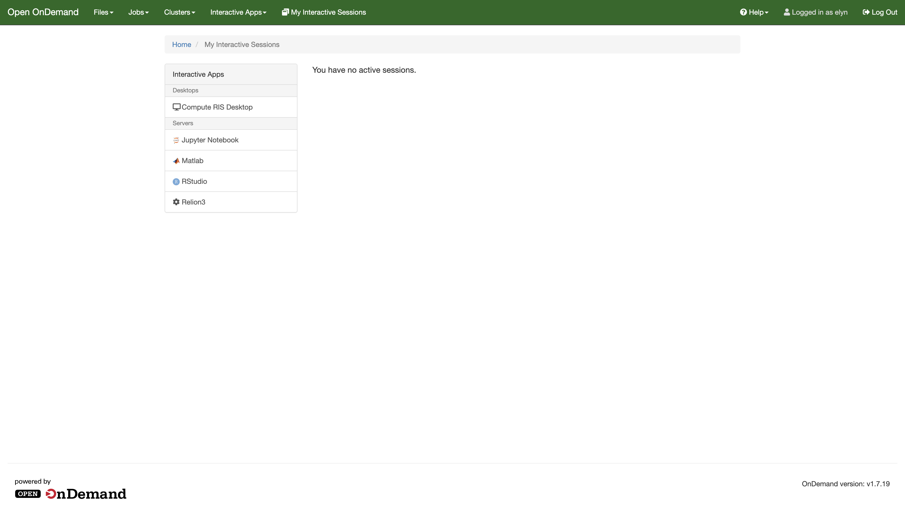

- Status - Queued: Submitted job is in queue to launch.

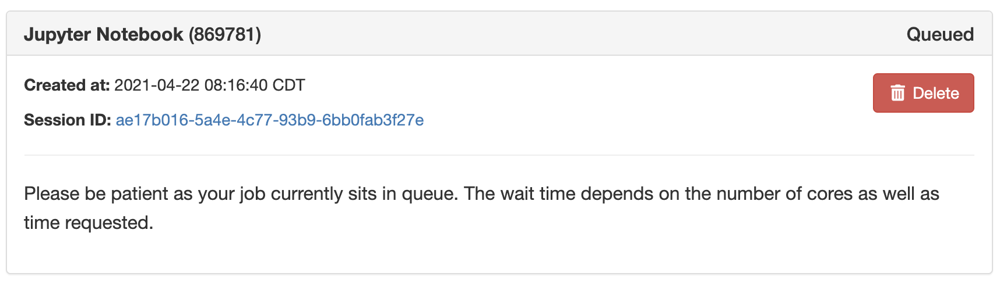

- Status - Starting: Job is in the process of launching (image download, startup scripts running, etc).

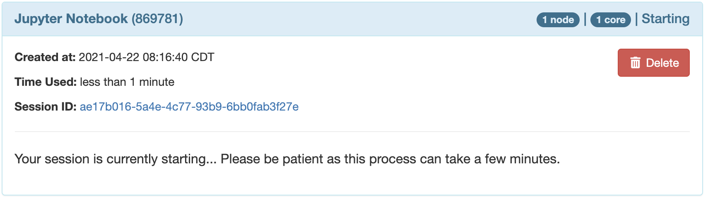

- Status - Running: Job has started and is ready to launch a GUI.

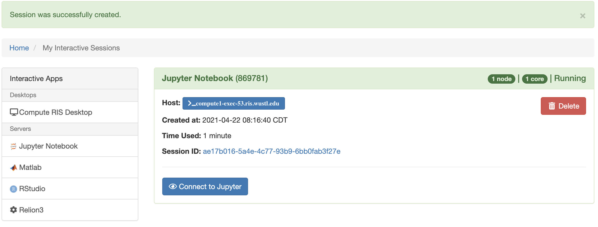

- Job sessions can be terminated in the My Interactive Sessions page.

# Terminal

- There are multiple locations from which a user can launch a terminal.
- Exactly as expected, this is a terminal that is launched through the web-browser allowing users to do command line work.


