[Compute1](../Compute1.md)

# Software Development Using Compute1

- [What will this documentation provide?](#what-will-this-documentation-provide)
- [What is needed?](#what-is-needed)
- [Getting Started](#getting-started)
- [Bringing It All Together](#bringing-it-all-together)
- [Setting Up Our Environment](#setting-up-our-environment)
- [Creating a Repository](#creating-a-repository)
- [Finding a Docker Image](#finding-a-docker-image)
- [Creating Our Docker Image](#creating-our-docker-image)
- [Creating Our Perl Script](#creating-our-perl-script)
- [Additional information](#additional-information)

> [!IMPORTANT]
> storageN
>
> - The use of `storageN` within these documents indicates that any storage platform can be used.
> - Current available storage platforms:
>
>   - storage1
>   - storage2

# What will this documentation provide?

- An introduction to using the RIS Compute Platform for software development.
- An example of creating a development environment and versioning software.
- All examples are done in Perl.

# What is needed?

- Access to the RIS Compute Platform.
- An account on Docker Hub. (<https://hub.docker.com/> )
- Knowledge of containers and using them.
- Knowledge of programming languages, particularly Perl.
- An account on GitHub. (<https://github.com/> )
- Visual Studio Code downloaded and installed. (<https://code.visualstudio.com/>)
- GitHub repository for the Dockerfile: <https://github.com/elynrfw/perl-docker>
- GitHub repository for the Perl script: <https://github.com/elynrfw/ris-perl-example>

# Getting Started

- When creating either a Docker image or developing software, it is considered best practices to develop in an environment that has the following aspects.

  - Allows for versioning.
  - Allows for collaboration in creation.
  - Allows for the potential to be easily shared.
- GitHub is a great free resource that allows for this.
- If you don’t already have a GitHub account, you can head over to <https://github.com/> and create one.

# Bringing It All Together

- The image below is a simple diagram of how all of the pieces and parts come together when using the Compute Platform in this manner.

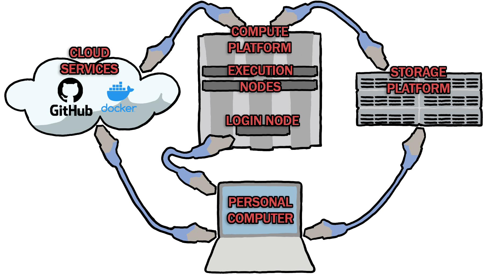

# Setting Up Our Environment

- Before we start work on the Compute Platform, we’re going to want to set up our environment there.
- The basic thing we’re going to be doing is adding the `LSF_DOCKER_VOLUMES` variable to our `.bash_profile`.
- To do this, we’ll want to login to the Compute Platform.

```java
ssh washukey@compute1-client-N.ris.wustl.edu
```

- The N can be replaced with the client number you’re using to connect, there are currently 5 (1, 2, 3, 4, 5).
- Once logged in, we’ll want to edit our `.bash_profile` file in our home directory. We’ll do that quickly with `vi(m)`.

```java
vi .bash_profile
```

- There may already be some code in the file. We don’t want to change any of that, we simply want to go to the end of the file and add our code.
- We’ll add the following at the end of the file.

```java
export STORAGEN='/storageN/fs1/${STORAGE_ALLOCATION}/Active:/storageN/fs1/${STORAGE_ALLOCATION}/Active'
```

- `${STORAGE_ALLOCATION}` can be replaced with what ever storage allocations you would like to have your account load by default.
- Once we have that added to the end of the file, we’ll save the file.
- Once our `.bash_profile` is updated and saved, to make it active in our current instance, we’ll have to source the file with the following command.

```java
source .bash_profile
```

- Now our account is set up to load the directories we told it to when we start up a session and we don’t have to worry about loading them when we submit a job.
- We can do this for any of the LSF environement variables that we would like to use by default.
- In the end, your file should look something like the following.

```java
# .bash_profile

# Get the aliases and functions
if [ -f ~/.bashrc ]; then
        . ~/.bashrc
fi

# User specific environment and startup programs

PATH=$PATH:$HOME/.local/bin:$HOME/bin

export PATH

export STORAGEN='/storageN/fs1/elyn/Active:/storageN/fs1/elyn/Active'
```

> [!IMPORTANT]
> LSF\_DOCKER\_VOLUMES in `.bashrc` and `.bash_profile`:
>
> - It is considered best practices not to include `LSF_DOCKER_VOLUMES` in your `.bashrc` or `.bash_profile` files.
> - Including this directly can cause issues with some software.
> - It is considered best practices to declare `LSF_DOCKER_VOLUMES` for each job individually.

# Creating a Repository

- Once you have an account and are logged in, you are ready to create a project within GitHub.
- You can do this by clicking the New button.

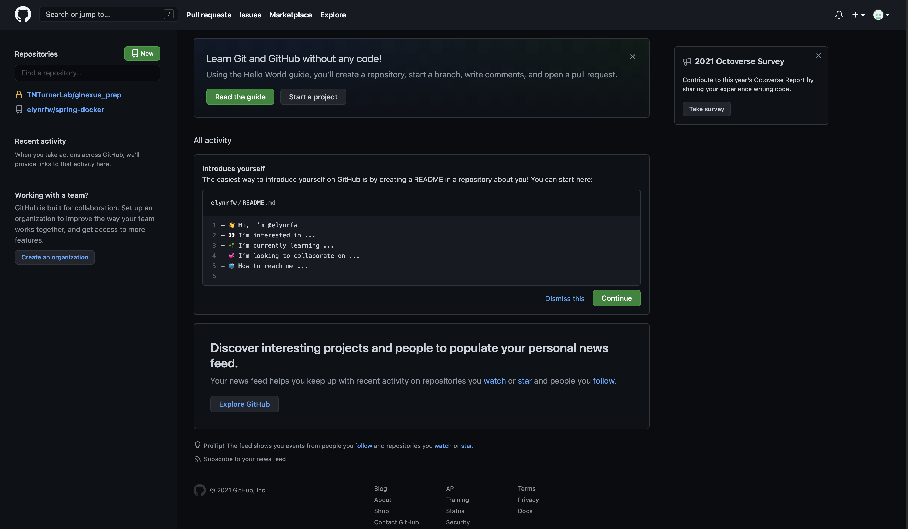

- This will take you to a page where you can put in the info necessary for creating a new repository for work.

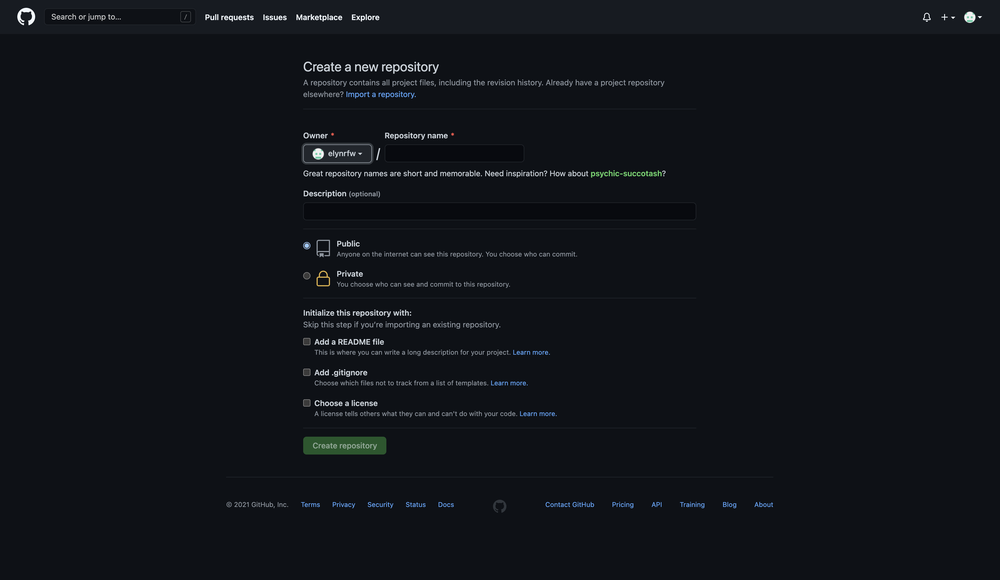

- First we will create a repository for our perl code project.
- We will name the repository `ris-perl-example`.
- Once this is done, you will be taken to the repository page, which will look like the following.

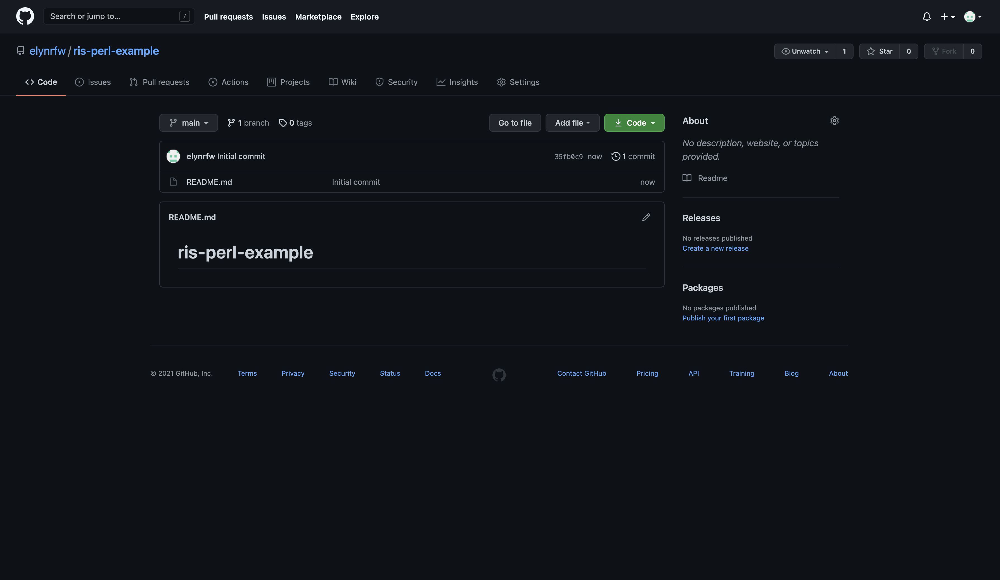

- From here, we can get the information necessary to make a clone of the repository in the Storage Platform.
- Clicking on the Code button will create a popup that will have the necessary information.
- We will want to copy the HTTPS information to clone this.

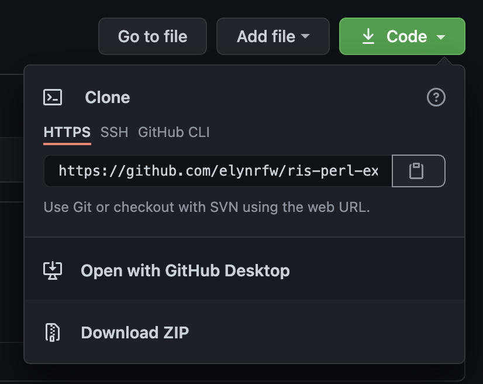

- Once we have that copied, we can log onto the Compute Platform.
- Once logged on, we’ll navigate to the directory we want to put our new github repository.
- Users can use their storage allocation for this and that is what we’ll be doing in this workshop.
- We will use the following command to clone our repository.

```java
git clone https://github.com/username/ris-perl-example.git 
```

- This will clone the repository and all files within it.

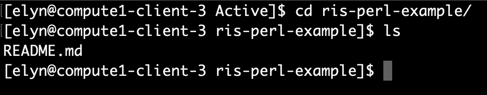

# Finding a Docker Image

- The next thing we’ll want to do is find a Perl Docker image to use for our development.
- If we head to <http://hub.docker.com> , we see that there are official Perl images.

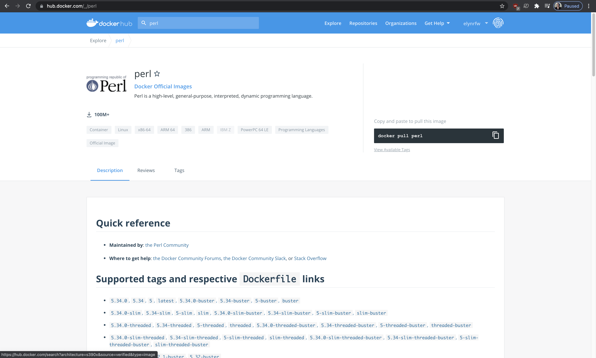

- Looking through the different versions available, for this example we will be using the slim-threaded version.
- We can go ahead and load into an interactive job session of the image to explore what the image all has.
- The first thing we’ll want to check is to see if the image as git installed.

```java
bsub -Is -G compute-workshop -q workshop-interactive -a 'docker(perl:slim-threaded)' /bin/bash
```

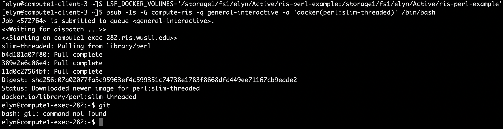

- It appears that git is not installed in the image. Therefore we will have to create our own image to make sure it is.

# Creating Our Docker Image

## Creating the Repository

- The first thing we will want to do, is find out what OS and version the image is running.
- We can do that with the following command.

```java
cat /etc/os-release
```

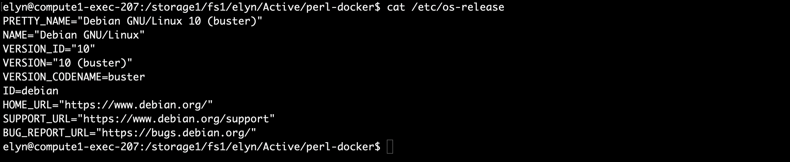

- Once we have that information, we know how we need to install packages or software.
- The container we’re using has a Debian OS, so we will be using apt-get to install git.
- Since we are creating our own Docker image and will want to potentially version this as well, we’ll create another GitHub Repository.
- Using the same process above, we’ll create one called, `perl-docker`.

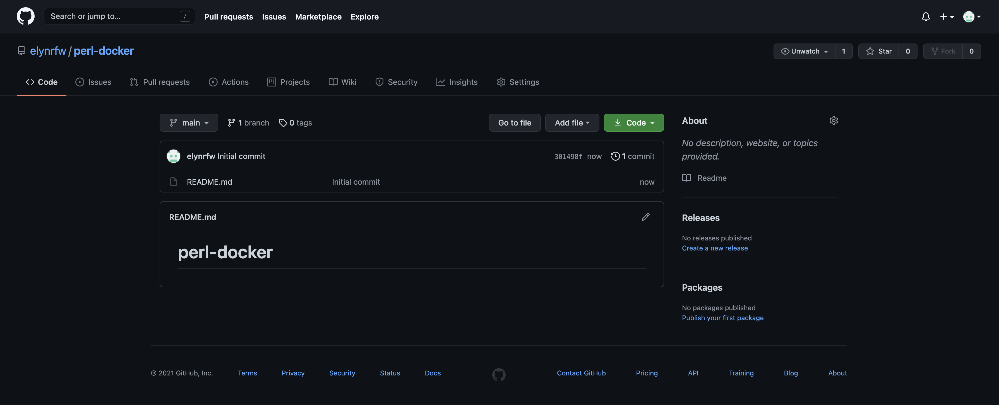

- Once we have the repository created, we can clone the repository like was done above with the following command.

```java
git clone https://github.com/username/perl-docker.git 
```

## Editing the Dockerfile

- Once we have the repository set up, we can create and edit our Dockerfile.
- There are mutliple text editors you can use to do this. Vi(m) is installed on Compute1 and you can use that.
- However, for this example, we will use Visual Studio Code (VSC).
- You can read the documentation on setting up VSC with Compute1 here: [Visual Studio Code on Compute1](Visual%20Studio%20Code%20on%20Compute1.md)

- In the select a Folder step in the mentioned docs, we will select our `perl-docker` directory.

- Once we have our directory open, we can see everything that was cloned in the step above, which at this point is the `README` file.

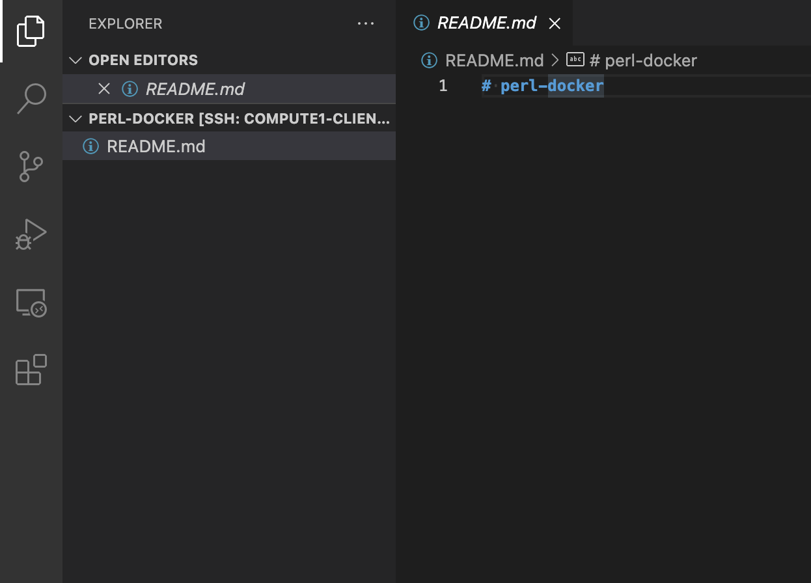

- From here, we can create a new file that we will call Dockerfile. This will be our Dockerfile that we will create our container from.
- Our Dockerfile will be really simple as we’re simply adding git to the Perl base that we’ll be using. As such, our file will look like the following.

```java
FROM perl:slim-threaded

RUN apt-get update && apt-get install -y --no-install-recommends git && apt-get clean
```

- This code lets the container know, it’s building from the `slim-threaded Perl` container.
- It also tells the container to install `git`. But we also want to update `apt-get` and need some install options so that git can cleanly install in a container.
- At the end we want `apt-get` to clean up as it will help keep our container clean and as slim as necessary as this helps with load times of the container.
- Once we have our code in our Dockerfile file, we can save it and it will save it through the Compute1 system so we can access it via connecting to Compute1.

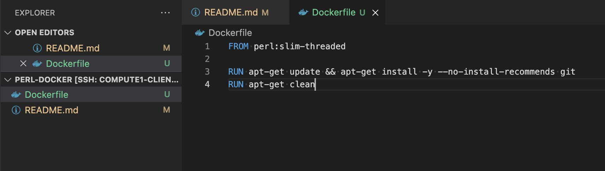

- Now that we have our Dockerfile all ready to go, we can go to Compute1 and commit our changes.
- First we will need to cd to our perl-docker directory.
- Then once there, we will need to add the files we want to submit to the commit we do this by using the `git add` command.

```java
git add Dockerfile
git add README.md
```

- Once that is done we can submit our commit with the `git commit` command.
- The commit command also allows you to label your commit. So we’ll label it like the following.

```java
git commit -m "Create Dockerfile and Update README"
```

- This creates the commit and it is now ready to be pushed to GitHub.
- To do this we will use the git push command.

```java
git push
```

- It will ask you for your username and either a password or personal access token as GitHub is moving away from passwords with commits.

  - GitHub is moving away from passwords and instead using personal access tokens. [You can find more information here.](https://docs.github.com/en/github/authenticating-to-github/keeping-your-account-and-data-secure/creating-a-personal-access-token)
- Once you have entered the required information it will push our changes to the repository on GitHub.

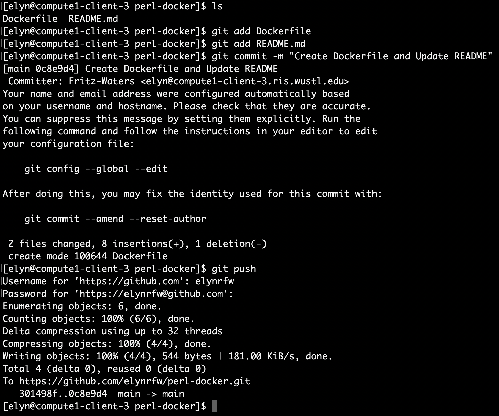

- We can now see these changes in the repository at GitHub.

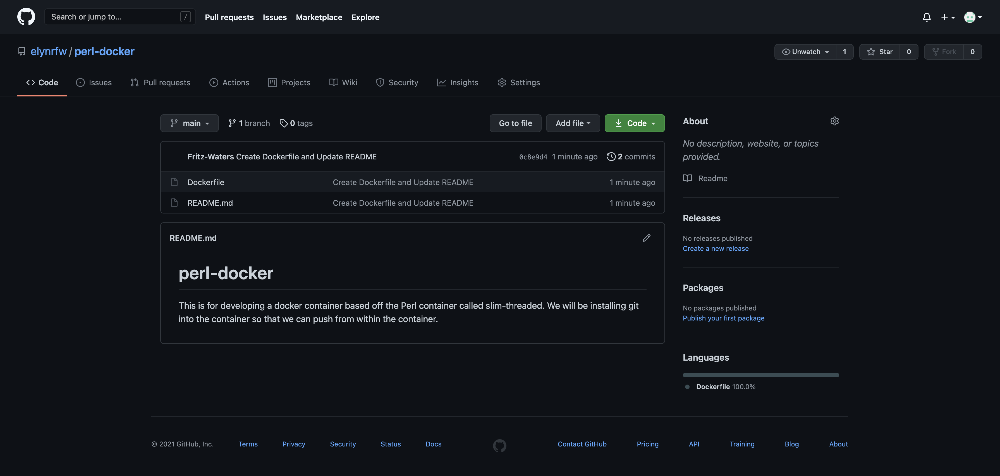

## Building The Dockerfile

- Now that we have our Dockerfile created and pushed to GitHub, we can build our container.
- This can be done directly on Compute1. For complete details, check out our Docker On Compute docs.
- We will want to use the following command on Compute1 to build and push our container.
- Before using this command, we will want to be in the directory that contains our `perl-docker` directory.

```java
bsub -G compute-workshop -q workshop-interactive -Is -a 'docker_build(username/perl-docker)' -- --tag 1.0.0 perl-docker/
```

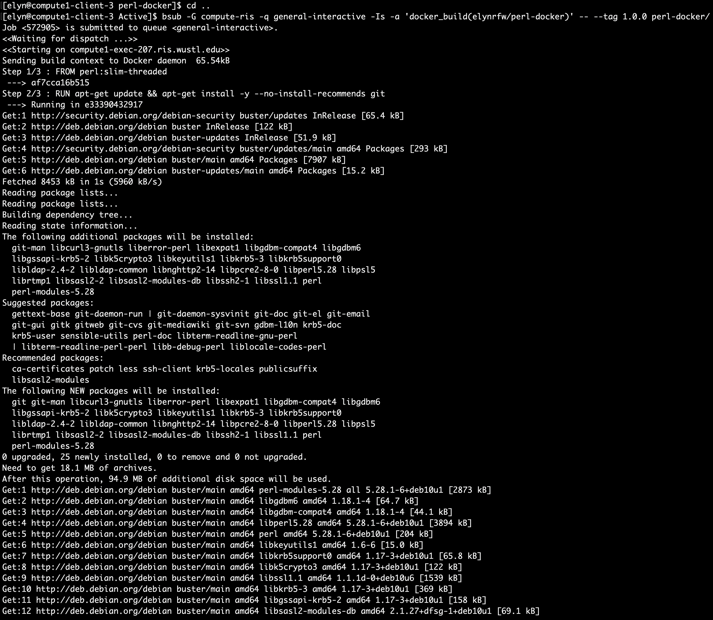

- This command will provide the Docker image with the tag we supply but also with the latest tag.
- Now that we have our Perl Docker image with git installed, we can test to make sure everything works.
- We can test it like we did the base Perl Docker image earlier.

```java
bsub -Is -G compute-workshop -q workshop-interactive -a 'docker(username/perl-docker:latest)' /bin/bash
```

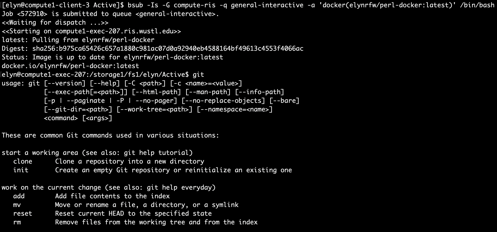

# Creating Our Perl Script

- Now that we have our Docker image how we want it, we can begin working on our Perl script.
- We’ve already created and cloned the repository so now we just need to connect to it like we did the Dockerfile repository.

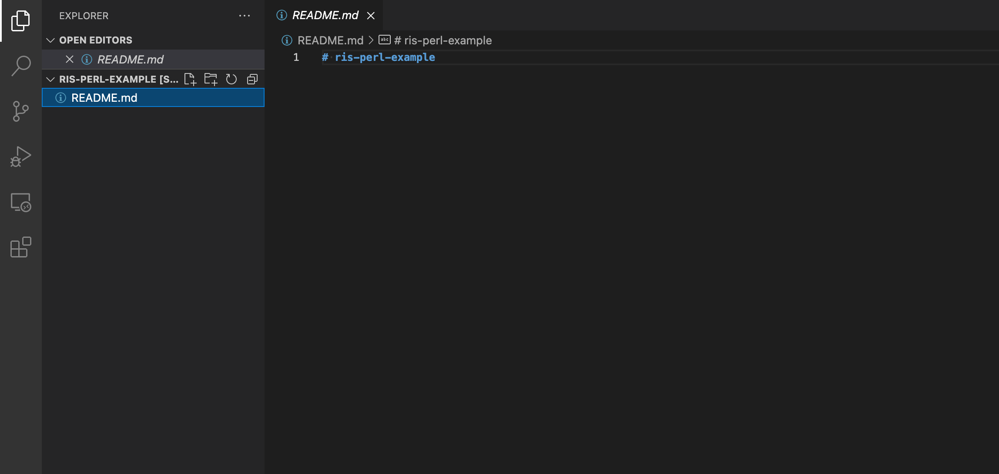

- For ease of doing this, we will want to open up a terminal within VSC.
- If we go to the Terminal menu and click new, this will open a terminal up within our `ris-perl-example` directory.
- From here we can do git commands.

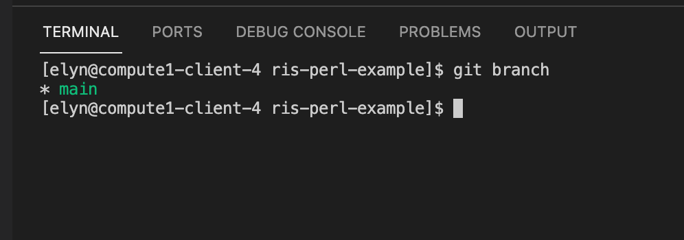

- From the `git branch` command, you can see we are currently on the main branch.
- In order to do versioning, we will want to create a new branch.
- We can do that with the following command.

```java
git checkout -b v1.0.0
```

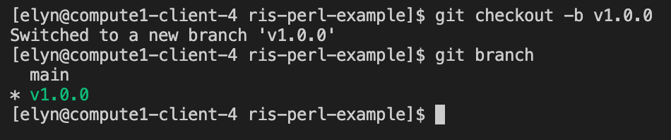

- Now we have a branch for version 1.0.0 of the script we will be creating.
- Now we can start working on our Perl script. The first part we will want to include in the Perl script is the declaration.
- We need to let the interpreter know it’s a Perl script and we want to make sure strict and warnings are turned on.
- These will keep us from potentially making mistakes in our Perl script.

```java
#!/usr/bin/perl

use strict;
use warnings;
```

- Now that we have that set up, we will want to set up the fact that we’re going to be reading in a file via standard input.
- And we want to set up any variables that will be needed.
- Do do this, we need to understand what we’ll exactly be doing.
- We will be taking the tab delimited file provided above (and here) and calculating statistics on every column.
- To do this, we will need an array for the input and an array for each statistics we want to calculate.
- For the first version of our script, let’s say we will simply calculate average and standard deviation.
- We will also need a counter to use for the input array.

```java
my $inputFile = $ARGV[0];
my @dataArray = @_;
my @avgArray = @_;
my @stdevArray = @_;
my $counter = 0;
```

- The first thing we need to do is to read in the file we gave the script via the command line.
- As we read in the file, we’ll store the data into an array.
- We can do that with the following code.

```java
open (DATAFILE, "<$inputFile");
while(my $finput = <DATAFILE>)
{
  chomp $finput;
  my @inputArray = split(/\t/, $finput);

  for(my $i=0; $i<scalar(@inputArray); $i++)
  {
    $dataArray[$counter][$i] = $inputArray[$i];
  }

  $counter++;
}
close DATAFILE;
```

- Now that we have our file loaded into an array, we can do the statistics we decided we wanted.
- This will require looping through the array to calculate the average and standard deviation for each column.
- To do this, we will need to use nested for loops.
- Our code for doing all of this should look like the following.

```java
for(my $i=0; $i<scalar(@{$dataArray[0]}); $i++)
{
  my $total = 0;
  my $number = 0;
  my $stdevTotal = 0;

  for(my $j=0; $j<$counter; $j++)
  {
    $total += $dataArray[$j][$i];
    $number++;
  }

  my $average = $total/$number;

  for(my $j=0; $j<$counter; $j++)
  {
    $stdevTotal += ($dataArray[$j][$i] - $average)*($dataArray[$j][$i] - $average);
  }

  my $stdev = sqrt($stdevTotal/($number-1));

  $avgArray[$i] = $average;
  $stdevArray[$i] = $stdev;
}
```

- Now that we have our statistics calculated, we will want to print these out to a file.
- We can do that in a couple of ways.

  - The first way is that we have the script print to standard out.
  - The second way is that we have the script print to a file that we provide the name of.
- We’re going to start by printing to standard out.
- To do that the code would be like the following.

```java
my $avgOutput = "";
my $stdevOutput = "";

for(my $i=0; $i<scalar(@avgArray); $i++)
{
  if($i == 0)
  {
    $avgOutput = $avgArray[$i];
    $stdevOutput = $stdevArray[$i];
  }
  else
  {
    $avgOutput .= "\t".$avgArray[$i];
    $stdevOutput .= "\t".$stdevArray[$i];
  }
}

print $avgOutput."\n";
print $stdevOutput."\n";
```

- This code loops through our statistics arrays and creates an output that it then prints out.
- We make use of an if/then statement because our addition to the output is different based off whether the statistic is the first in our array, or not the first.
- Now that our perl script should be good to go, we can go ahead and test it out by connecting to our Docker image like before.
- Once we’ve done that, we will run the following command.

```java
perl parse.example.pl example-data.text
```

- If we have coded everything correctly, we should see output like the following.

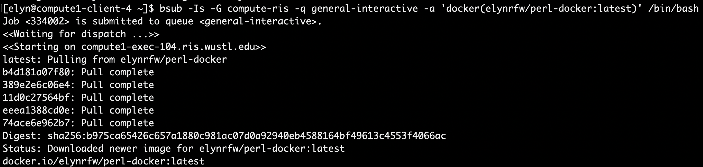

- As we can see, the software prints out the information that we told it to.
- Now that we have our software written, we can push our branch to GitHub.
- Since we are not pushing to the master branch in this case, our push command will give us an error saying we have to add an upstream branch.
- The way to do this is included in the following commands.

```java
git add README.md
git add example-data.txt
git add parse.example.pl

git commit -m "First commit version 1.0.0"

git push --set-upstream origin v1.0.0
```

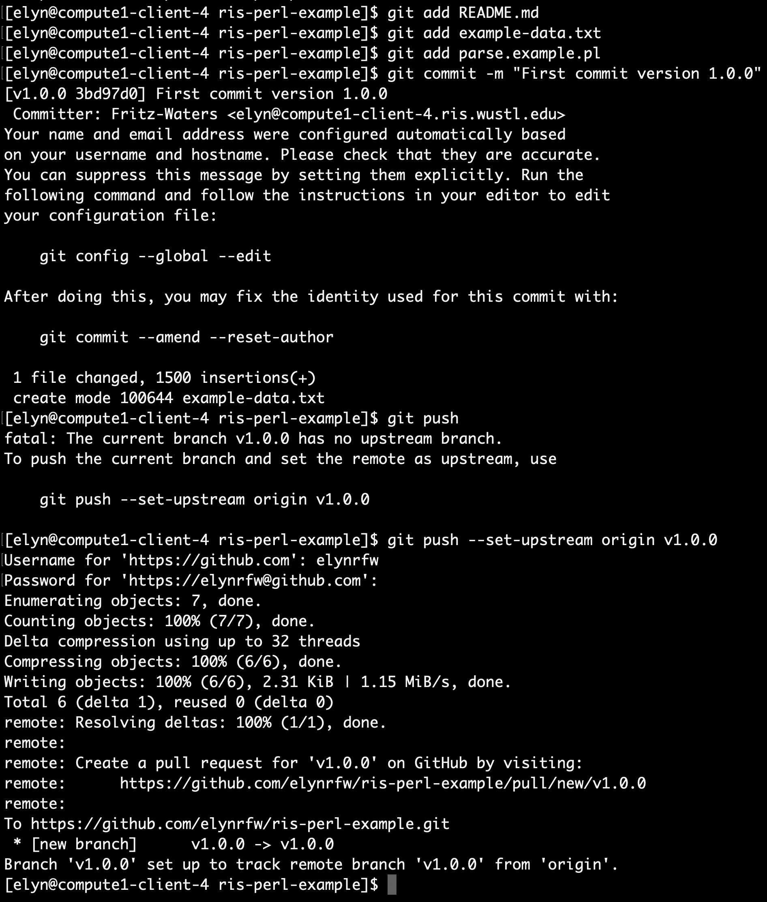
> [!IMPORTANT]
> In this particular case we have added our data to the GitHub repository simply for access for this workshop.This is not a best practices and one should not include any sort of sensitive information within a GitHub repository.

- If we go back to our GitHub account in the web browser, we can see that there is now a pull request for our branch.

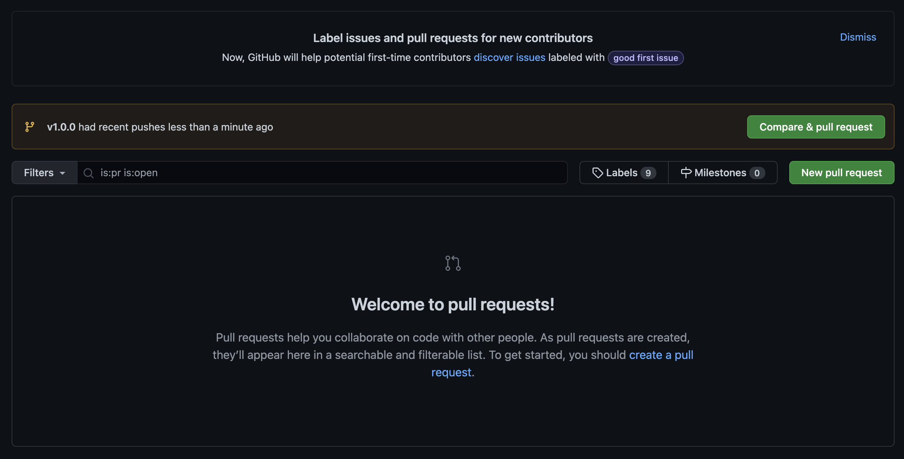

- We can go ahead and click on the `Compare & Pull Request` button.
- When we do, we are taken a page where we can create a pull request for merging this particular branch with the main branch.

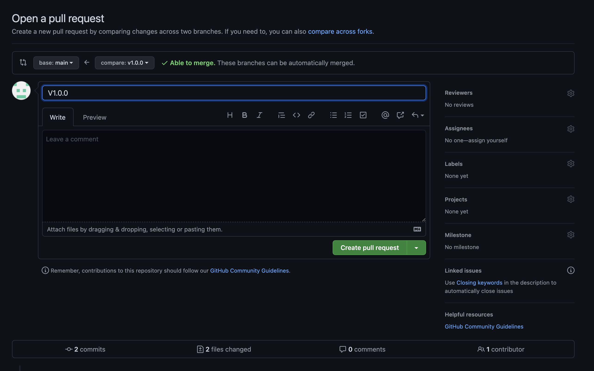

- Once we click the button to create the pull request, it will create the request and have an option for us to merge said request.

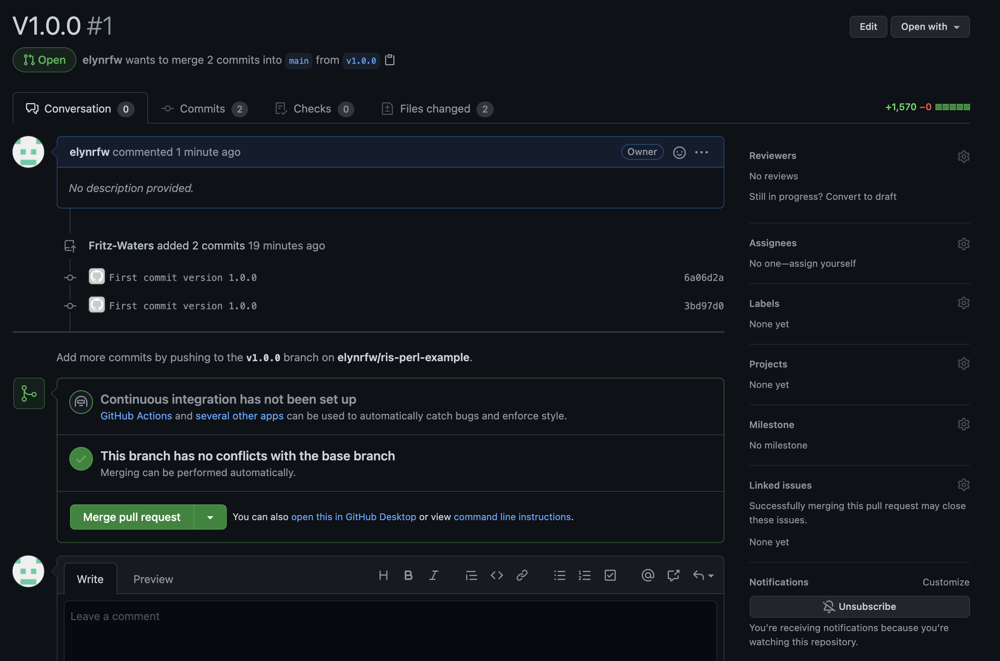

- We will go ahead and click the merge button and merge this into the main branch.
- When we do it will give us the option to delete our `v1.0.0` branch. We can do this, or we can leave it intact for previous version purposes.
- In our case, we will leave it intact.

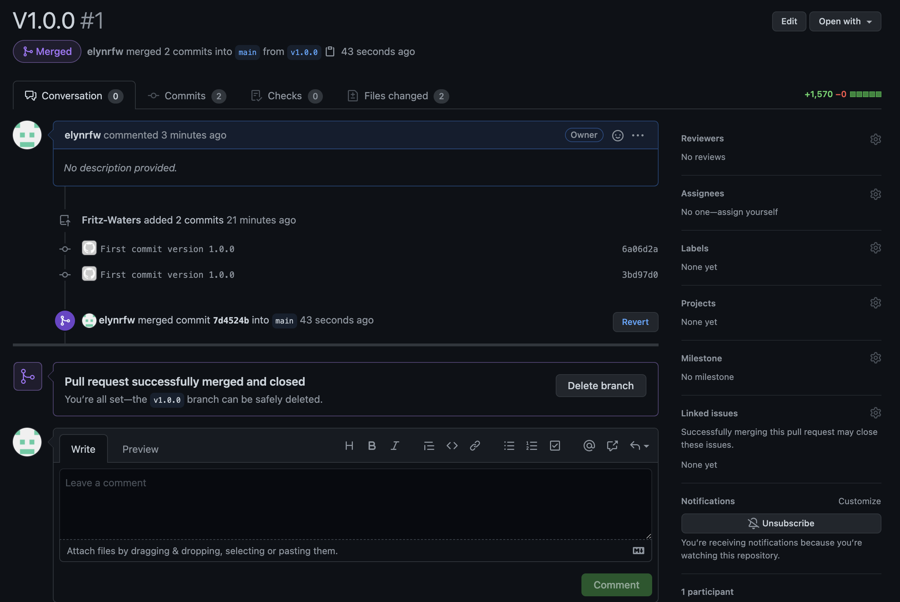

- If we go back to looking at our base repository in GitHub, we can now see that the main branch has our v1.0.0 files.

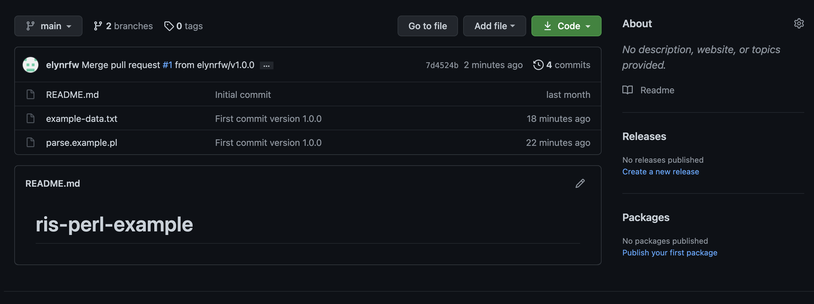

# Additional information

## Software Development Best Practices

- Below are some links to what are considered some of the software best practices and should be kept in mind while developing.

  - <https://distantjob.com/blog/software-engineering-best-practices/>
  - <https://www.classicinformatics.com/blog/a-handbook-to-successful-software-development-practices>
  - <https://www.tiempodev.com/blog/software-development-best-practices/>
  - <https://www.techicy.com/best-practices-for-software-development-to-follow-in-2021.html>

## Debugging Practices

- Below are some links to information about debugging. Something necessary for software development.

  - <https://en.wikipedia.org/wiki/Debugging>
  - <https://en.wikipedia.org/wiki/Rubber_duck_debugging>
  - <https://jonskeet.uk/csharp/debugging.html>
  - <https://www.geeksforgeeks.org/debugging-tips-to-get-better-at-it/>
  - <https://blog.hartleybrody.com/debugging-code-beginner/>

## File Naming Best Practices

- File names should be precise as NTFS file name size has a limit of 255 characters

  - This is a hard limit of the system that the Storage/Compute platform uses.
  - Any files to be transferred to Storage/Compute need to be created following this limit or they cannot be transferred.
- Files should be named consistently.
- File names should be short but descriptive.
- Avoid special characters or spaces in a file name.
- Use capitals and underscores instead of periods or spaces or slashes.
- Use date format ISO 8601: YYYYMMDD.
- Include a version number.
- Write down naming convention in data management plan.
- Elements to consider using in a naming convention are.

  - Date of creation
  - Short Description
  - Work
  - Location
  - Project name or number
  - Sample
  - Analysis
  - Version number
