---
tags:
  - '#compute1'
  - '#vscode'
---

[Compute1](../Compute1.md)

# Visual Studio Code on Compute1

- [Connecting to Compute1](#connecting-to-compute1)
- [Opening a Storage Directory](#opening-a-storage-directory)
- [Testing Code](#testing-code)

This documentation goes over how to connect to Compute1 through Visual Studio Code (VSC) for code editing and development purposes.

VSC can be found here: <https://code.visualstudio.com/>

VSC is a rather expansive editor that has many features and extensions that you can add to help customize your experience.

VSC is also free and open source and has Mac OS, Windows, and Linux versions available.

> [!WARNING]
> There is a known issue with the newer versions of VSC (1.101+) please use version 1.100. It can be downloaded here: <https://code.visualstudio.com/updates/v1_100>

# Connecting to Compute1

- In order to connect to Compute1, an extension will need to be installed that enables an ssh connection to be established.

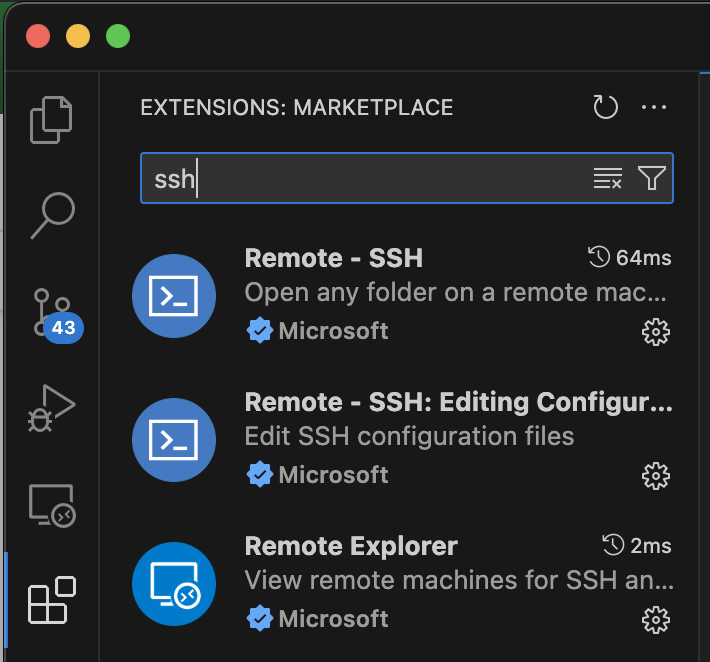

- “Remote - SSH” is the recommended extension for this. Simply click the Install button and VSC will install the extension.
- Once “Remote - SSH” has been installed, to connect, click the double carrot icon in the bottom left corner of the window.

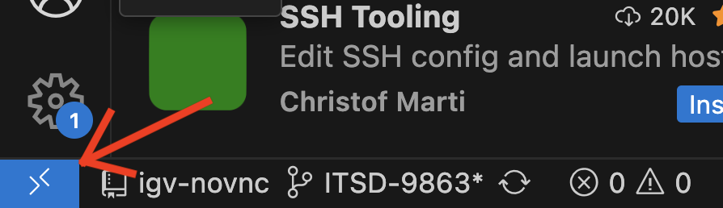

- After clicking the icon, it will open a new window and at the middle of the top of the window, there will be box that, when selected, will give a dropdown menu.
- Select, `Connect to Host...`

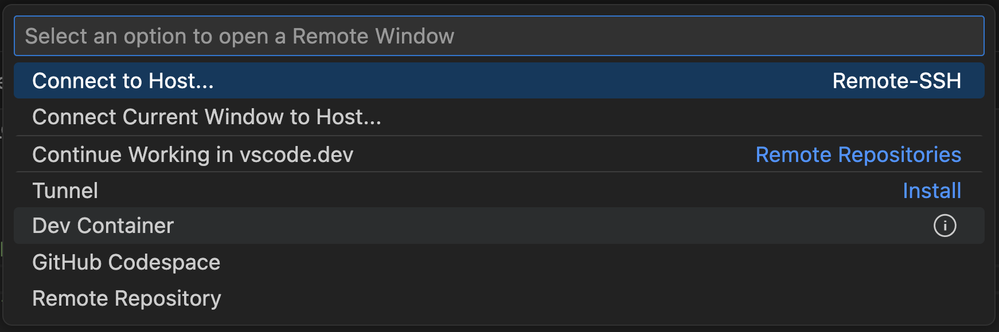

- This will open the option to connect to a host.

## First Time Connecting

- Click on the `Add New SSH Host…`.

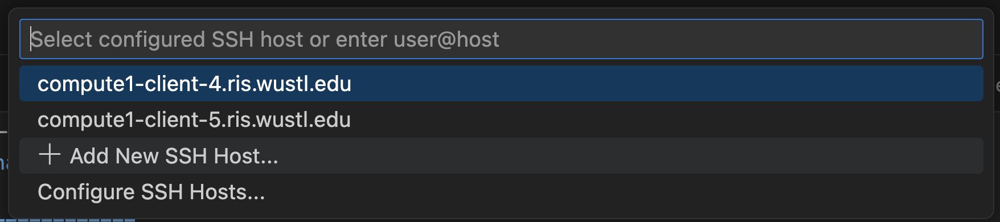

- Enter the information for one of the Compute1 login clients.

```
ssh washukey@compute1-client-N.ris.wustl.edu
```

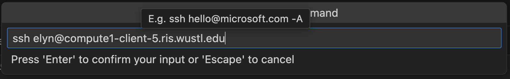

- It will ask to select an SSH configuration file to use, select the top one (local config).

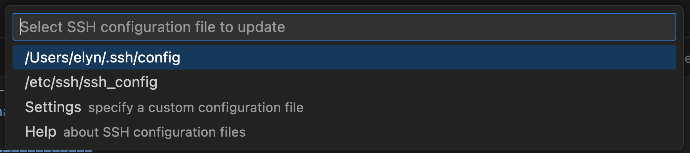

- A pop box will appear in the bottom right corner, click the Connect button.

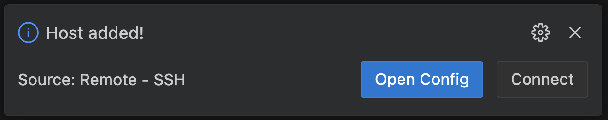

- It will then prompt for a password. Use the password associated with the WashU key.

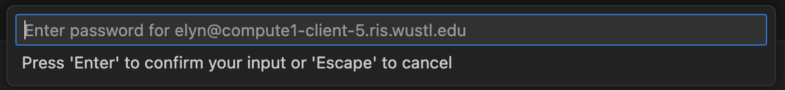

- Once connected, it will default to a screen without any directories open.

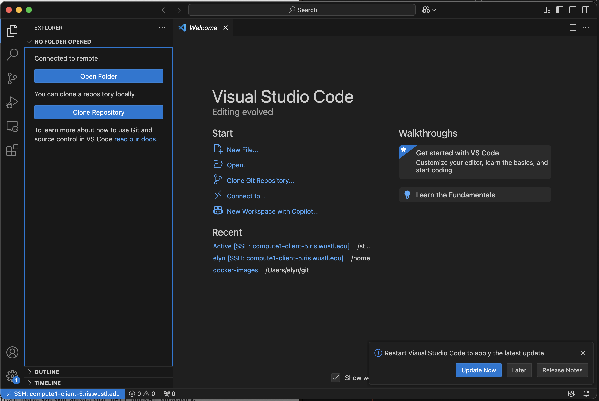

## Connecting to an Established Host

- Click on an established login client to use to connect.


- It will then prompt for a password. Use the password associated with the WashU key.


- Once connected, it will default to a screen without any directories open.


# Opening a Storage Directory

- On the left side of the window there will be an “Open Folder” button. To open a folder or directory, click on this button.

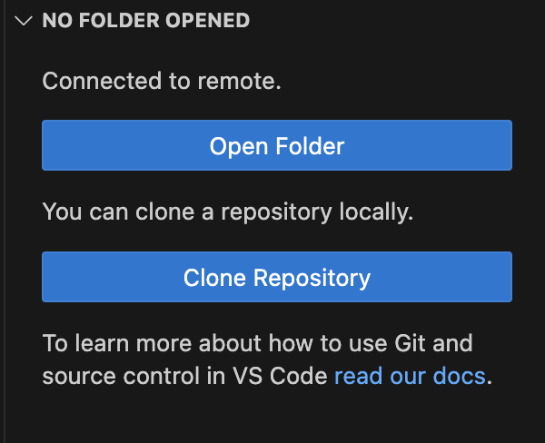

- It will ask what folder to open. This defaults to the home directory on Compute1, but any Storage allocation can be used.

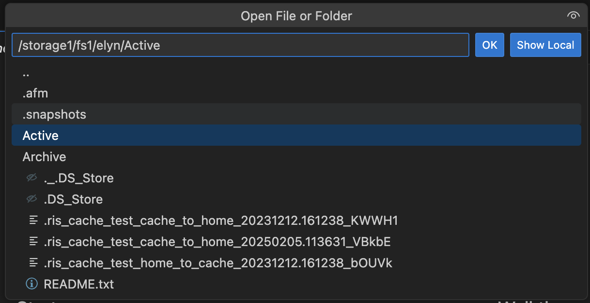

- Once the Storage allocation has been selected, files can be opened and edited.

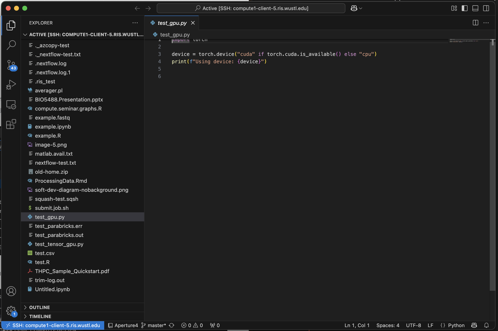

# Testing Code

- In order to test the code or scripts that are being developed, a terminal session will need to be opened.
- This can be done via the icons in the top right of the window.
- Click on the 2nd from the right icon to open a terminal.

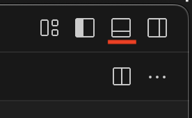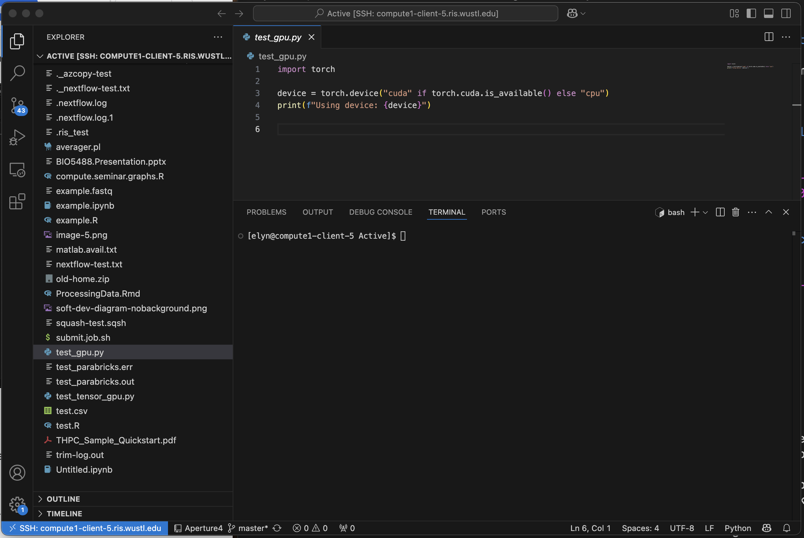

- Once the terminal is open, the code can be tested.

> [!WARNING]
> Just like when using software or code for analysis, users need to launch a job to run tests for development.

- Start up an interactive job via a bsub command using a Docker image that has the software or development environment needed for the code being developed.

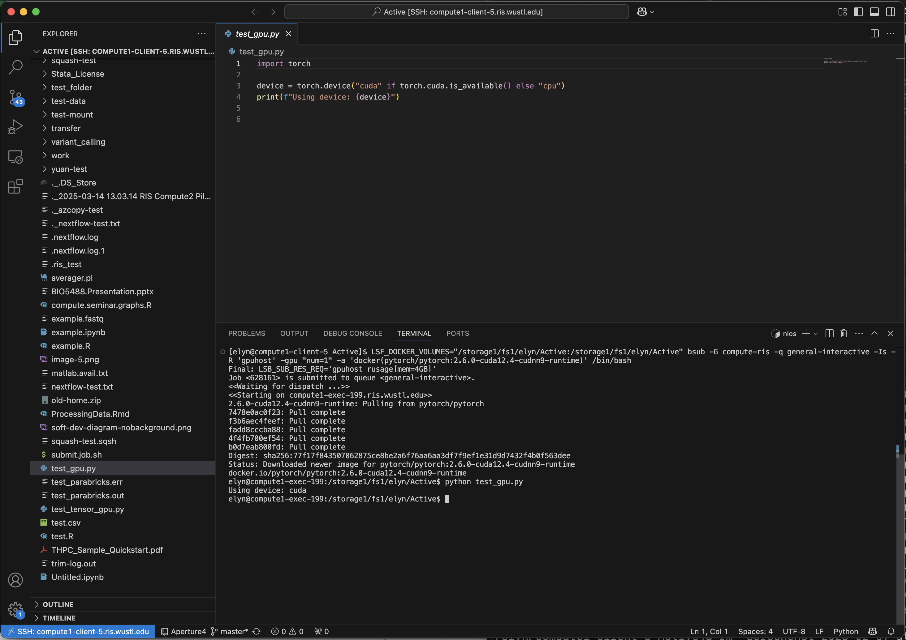

- Code and software can now be edited and tested using Compute1 resources.
