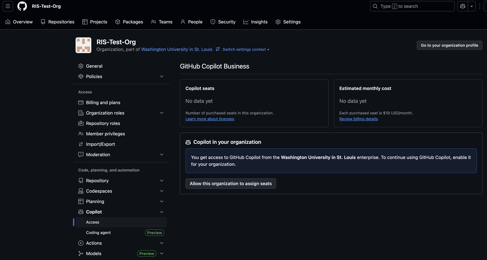
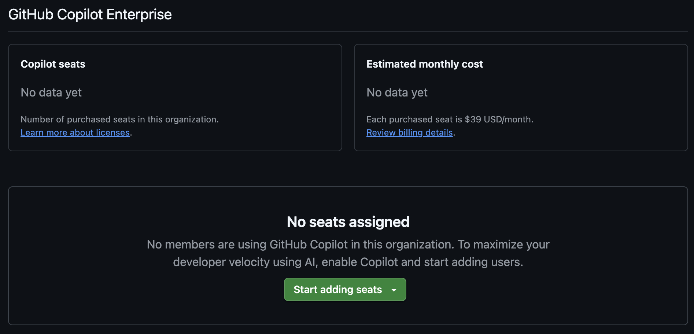
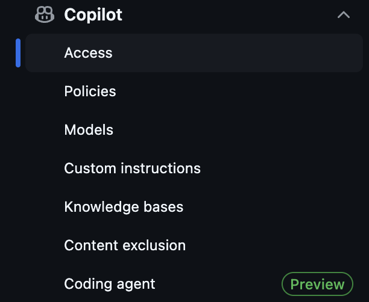
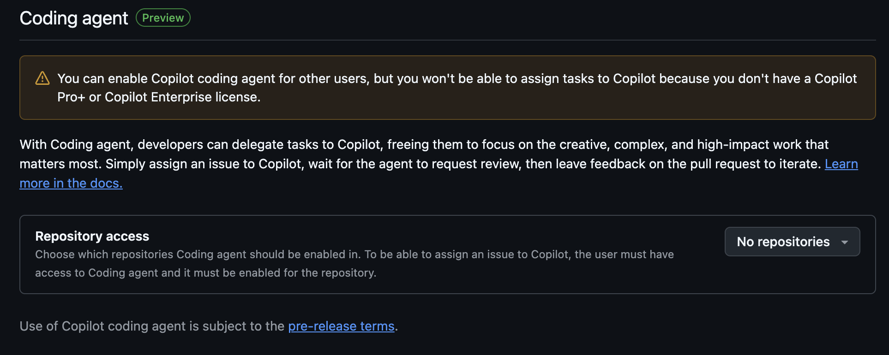
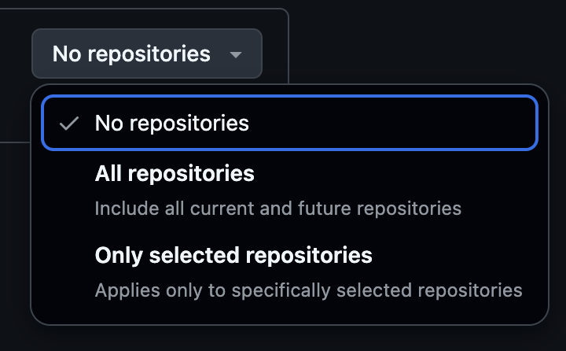

[Research Applications and Services](../Research%20Applications%20and%20Services.md)

# Github Enterprise

- [Request New Organization](#request-new-organization)
- [Request Organization Migration](#request-organization-migration)
- [Copilot](#copilot)

RIS offers a Github Enterprise for WashU researchers to utilize for development management.

- Requests can be made for a new Github Enterprise Organization, or request the move of an existing organization through the RIS Service Desk.
- Request Provisioning or Migration of GitHub Organization

# Request New Organization

- Go to the Service Desk and click on Research Applications and Services.
- Click on Request Provisioning or Migration of GitHub Organization.
- Required Information:

  - Organization name
  - Email address for at least 2 organization owners

# Request Organization Migration

- Go to the Service Desk and click on Research Applications and Services. <https://washu.atlassian.net/servicedesk/customer/portal/2/group/10/create/45>
- Click on Request Provisioning or Migration of GitHub Organization.
- Required Information:

  - Existing organization name of which the requester is an owner.

> [!IMPORTANT]
> - Per GitHub, “Once approved, the organization’s ownership and billing will be transferred to Washington University in St. Louis’s enterprise account.”
> - GitHub is not approved for confidential, HIPAA, or any protected information.

# Copilot

## General Information

- Copilot through GitHub is approved for use, however, there are a few things to note about it’s use.

  - Do not use GitHub Copilot with any personally identifiable, confidential or sensitive information, especially protected health information, as it does not meet WashU HIPAA, FERPA nor similar compliance requirements.
  - RIS highly recommends reviewing thoroughly the FAQ at <https://github.com/features/copilot> as it pertains to privacy and responsible AI (ex: potential for insecure code suggestions).
  - Individual billing for this service is not currently required due to the WashU Enterprise Licensing configuration.
  - RIS encourages use of content exclusion options to ensure Copilot won't be able to access or utilize the contents located in those specified paths. Example configuration:

```java
"*":
  - "**/*.cfg"
  - "**/*.conf"
  - "**/*.config"
  - "**/*.csv"
  - "**/.env"
  - "**/*.env.*"
  - "**/*.json"
  - "**/*.Renviron"
  - "**/*.tsv"
  - "**/*.xml"
  - "**/*.yaml"
  - "**/*.yml"
  - "**/*.yml.erb"
  - "**/*.yaml.erb"
```

## Getting Access and Setting Up

- Owners of a GitHub group can set up access to Copilot through the settings option for the group.


- Once in settings, select the Copilot option on the side menu (left hand side).


- From here, select the Access option and it will take you to a page where you can add members of the group to have access to Copilot.

  - If you see the following when you go to this page, your group will need to have access granted at the Enterprise level.



- You can request access to Copilot through the RIS Service Desk: <https://washu.atlassian.net/servicedesk/customer/portal/2/group/10/create/45>
- Once access has been granted, or if you already have access, you should see the following where you can add users.



- The options available under Copilot is also expanded in the side menu.



- From this list, owners can set up the policies for their group, determine which models to use, and set up Knowledge bases to use to help influence their instance of Copilot.
- The final option in the list is the Coding agent. Owners can set up the Coding agent for their group on a repository basis.



- For further questions on how to manage a GitHub group, please see the GitHub Documentation: <https://docs.github.com/en/enterprise-cloud@latest/copilot/managing-github-copilot-in-your-organization/granting-access-to-copilot-for-members-of-your-organization>
