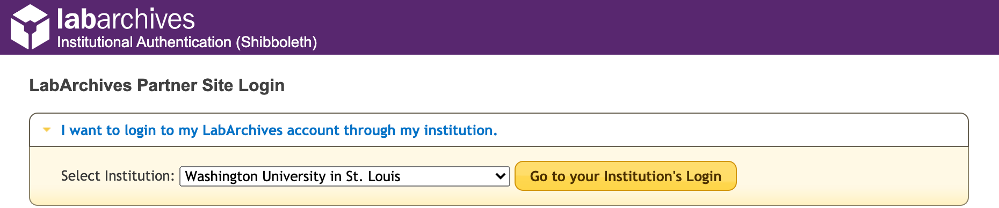

[Research Applications and Services](../Research%20Applications%20and%20Services.md)

# LabArchives Notebook

# Overview

This page serves as a resource for users of the WashU Electronic Laboratory Notebook (ELN) powered by [LabArchives](https://www.labarchives.com/).

# Contents

## Before You Get Started

- If you are reading this document, it is assumed that you are a member of the Washington University user community.
- We assume you have a WashU Key Identity
- WashU ELN users agree to abide by the following:

  - [WashU Computer Use Policy](https://informationsecurity.wustl.edu/policies/computer-use-policy)
  - [WashU Information Security Policy](https://informationsecurity.wustl.edu/faculty-staff-students/security-policies-2/information-security-policy)
  - [WashU System Access Control Policy](https://wustl.edu/about/compliance-policies/computers-internet-policies)
  - [LabArchives Terms of Use](https://www.labarchives.com/terms-of-use/)

# Accessing WashU ELN

To access WashU ELN, navigate to the LabArchives login page and select Washington  
University in St. Louis from the drop-down menu.

# Quick Start Guides

LabArchives provides downloadable quick start guides for:

### [New Users](https://docs.ris.wustl.edu/_downloads/9379ffec15344133693093fdc0b1b612/labarchives_qs_new_users.pdf)

### [Instructors](https://docs.ris.wustl.edu/_downloads/4daa38b152e0823e1cf9ba48128a748b/labarchives_qs_instructors.pdf)

### [Students](https://docs.ris.wustl.edu/_downloads/044cd62c889a549b457c65f041c568f2/labarchives_qs_students.pdf)

### [Setting up a Team Notebook](https://docs.ris.wustl.edu/_downloads/9e161bd3ea7e352bfe02cd0b0b35be51/labarchives_qs_teams.pdf)

# WashU ELN Resources

## Becker Medical Library LabArchives Recorded Training Sessions

### **For Researchers**

<https://vimeo.com/412787037>

### **For Instructors**

<https://vimeo.com/412830697>

FAQ

- [WashU ELN FAQ](LabArchives%20Notebook/WashU%20ELN%20FAQ.md)
